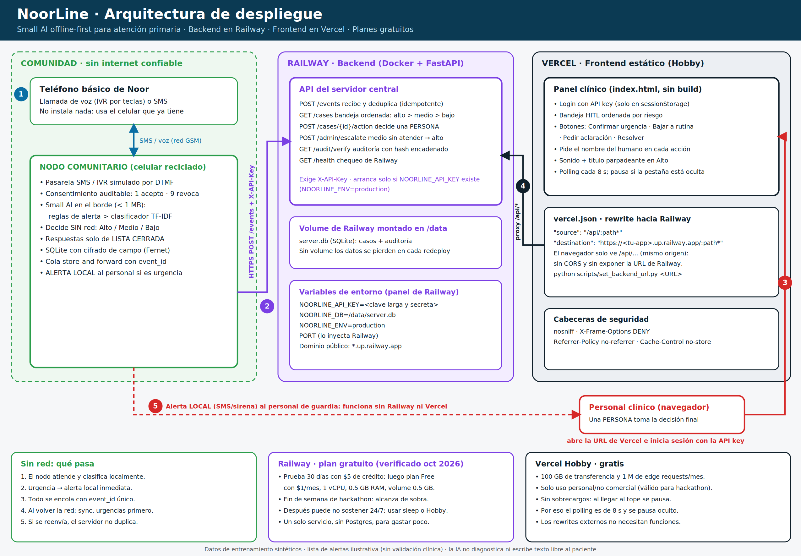

# Despliegue: Railway (backend) + Vercel (frontend) en planes gratuitos



## Flujo
1. Noor llama/envía SMS → **nodo comunitario** (offline, decide y alerta localmente, encola).
2. El nodo hace `POST /events` con `X-API-Key` **directo a Railway** cuando hay red (store-and-forward, idempotente).
3. El personal abre la URL de **Vercel** e inicia sesión con la API key.
4. El navegador llama `/api/*` (mismo origen); **Vercel reescribe** hacia el dominio público de Railway. Sin CORS y sin exponer la URL de Railway.
5. Urgencias: alerta local inmediata del nodo; no depende de Railway ni de Vercel.

## 1. Backend en Railway
1. Sube el repo a GitHub. Railway → New Project → Deploy from GitHub repo (detecta `Dockerfile` y `railway.json`).
2. **Variables** del servicio: `NOORLINE_API_KEY` (larga y secreta; ej. `python -c "import secrets;print(secrets.token_urlsafe(32))"`). `NOORLINE_DB=/data/server.db` y `NOORLINE_ENV=production` ya vienen en el Dockerfile.
3. **Volume**: agrega un Volume montado en `/data` (sin él, la base SQLite se pierde en cada redeploy).
4. Settings → Networking → **Generate Domain**. Copia la URL `https://xxxx.up.railway.app`.
5. Verifica: `curl https://xxxx.up.railway.app/health` → `{"ok":true,"demo_open":false}`. Sin `X-API-Key`, `/cases` responde 401.
   Si el contenedor no arranca, falta `NOORLINE_API_KEY` (es intencional).

## 2. Frontend en Vercel
```bash
python scripts/set_backend_url.py https://xxxx.up.railway.app   # edita frontend/vercel.json
git add -A && git commit -m "backend url" && git push
```
Vercel → Add New Project → mismo repo → **Root Directory = `frontend`**, Framework = Other, sin build command. Abre la URL, entra con la API key.
Si cambia el dominio de Railway, vuelve a correr el script y haz push (el destino del rewrite no admite variables de entorno).

## 3. Nodo → Railway
```bash
export NOORLINE_API_KEY=<la misma clave>
make node-prod URL=https://xxxx.up.railway.app    # o: python -m noorline.cli --server https://xxxx.up.railway.app
```
Escribe un SMS de prueba, `/sync`, y míralo aparecer en el panel de Vercel.

## Limites de los planes gratuitos (verificados oct 2026; confirma en sus paginas)
- **Railway:** prueba de 30 dias con $5 de credito; luego plan Free con $1/mes de credito, 1 vCPU, 0.5 GB RAM y volume de 0.5 GB. Para el fin de semana del hackathon alcanza. Para 24/7 despues, el credito de $1 probablemente no basta: activa el modo sleep del servicio (el nodo reintenta con store-and-forward, asi que tolera el arranque en frio) o pasa a Hobby ($5/mes).
- **Vercel Hobby:** gratis, 100 GB de transferencia, 1 M edge requests/mes, sin sobrecargos (se pausa al llegar al tope). **Solo uso personal/no comercial**: valido para el hackathon; un despliegue real a clinicas requeriria Pro u otro hosting.
- El panel hace polling cada 8 s y se pausa con la pestana oculta para no gastar edge requests.
- Un solo servicio en Railway y SQLite en volume (sin Postgres) para minimizar costo.

## Seguridad en produccion
- La API key vive en Railway y en `sessionStorage` del navegador del personal (no en el repo ni en el HTML).
- El servidor se niega a arrancar sin clave (`NOORLINE_ENV=production`).
- No envies datos clinicos por SMS. HTTPS lo da Railway/Vercel. Rota la clave si se filtra.
- Sigue siendo prototipo: datos sinteticos y lista de alertas sin validacion clinica.
